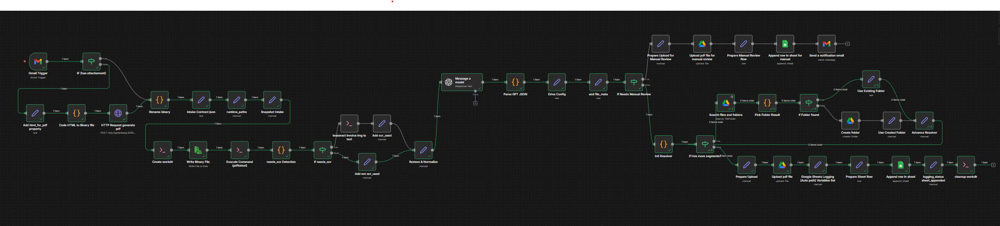
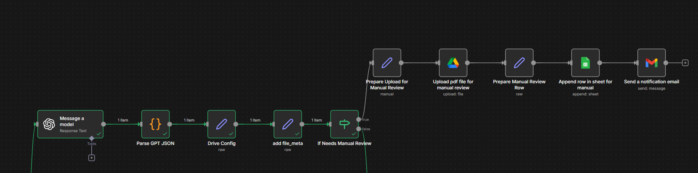
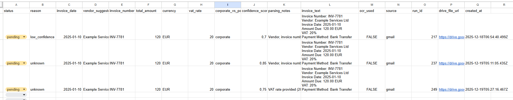

# AI Invoice Automation System  
**n8n + ChatGPT (OpenAI) | Gmail | Google Drive | Google Sheets**

---

## Project Overview

This project is a production-grade AI-powered invoice automation system designed to replace manual invoice handling with a reliable, auditable, and scalable workflow.

The system automatically ingests invoices from email and manual uploads, normalizes documents, extracts structured financial data using OCR and AI, applies business validation rules, and routes invoices based on confidence and completeness. All outputs are stored in Google Drive and logged in Google Sheets with full traceability.

This solution is built to reflect real-world client requirements, not a demo or tutorial setup.

---

## Business Problem

Invoice processing is typically manual, inconsistent, and difficult to scale. Common issues include:

- Invoices arriving in different formats (PDF, scanned images, HTML emails)
- Missing or ambiguous invoice fields
- High operational overhead for validation and data entry
- Lack of confidence in AI-extracted data
- No clear audit trail for automated decisions

Businesses need automation that reduces manual effort **without sacrificing accuracy, control, or accountability**.

---

## Solution Architecture

The system follows an event-driven automation architecture orchestrated by **n8n**, with AI used selectively and defensively.

**High-level design principles:**
- Normalize all inputs before processing
- Prefer deterministic tools over AI where possible
- Use AI only for structured extraction, not decision-making
- Route uncertain cases to human review
- Log every step for auditability

**Core components:**
- Gmail as the primary intake channel
- n8n for orchestration and routing
- Gotenberg for HTML-to-PDF conversion
- pdftotext and Tesseract OCR for text extraction
- ChatGPT for structured invoice parsing
- Google Drive for file storage
- Google Sheets for logging and review workflows

---

## Visual Overview

### End-to-End Workflow

### AI Parsing & Confidence-Based Routing

### Logging & Manual Review

---

## Workflow Breakdown (Modules)

### 1. Intake & Normalization
- Triggered by labeled Gmail messages
- Supports:
  - PDF invoice attachments
  - HTML-only invoices converted to PDF
  - Manually uploaded invoice files
- All inputs are normalized into a single PDF format for downstream processing

### 2. Text Extraction & OCR Decision
- PDF text is extracted using `pdftotext`
- Heuristics evaluate text quality (length and character ratio)
- OCR (Tesseract) is used only when text extraction is insufficient
- OCR usage is explicitly tracked per invoice

### 3. AI Invoice Parsing
- Extracted invoice text is sent to ChatGPT with:
  - A strict JSON schema
  - Explicit anti-hallucination rules
  - Mandatory confidence scoring
- The model must return valid JSON only
- Invalid or incomplete AI output is treated as a controlled failure

### 4. Validation & Routing
Invoices are routed based on objective rules:
- Parsing success
- Confidence score threshold
- Presence of required business fields

**Outcomes:**
- Auto-approved invoices
- Manual review required

### 5. Storage & Organization
- Invoice PDFs are stored in Google Drive
- Folder structure is created dynamically based on:
  - Year
  - Invoice classification (e.g. corporate vs personal)
- File naming is deterministic and human-readable

### 6. Logging & Notifications
- All processed invoices are logged to Google Sheets
- Manual review cases are:
  - Logged to a dedicated review sheet
  - Trigger email notifications with direct file and sheet links

---

## AI Parsing Strategy

AI is used as a constrained extraction layer, not a source of truth.

Key design decisions:
- Deterministic tools first, AI second
- Strict schema enforcement
- Explicit handling of missing or uncertain values
- Mandatory confidence scoring
- Business heuristics embedded directly in the prompt

This ensures predictable behavior, safe automation, and easy human review.

---

## Error Handling & Manual Review

The system is designed to fail safely.

Manual review is triggered when:
- AI output is invalid or unparsable
- Confidence score falls below the defined threshold
- Required classification fields are missing

Each manual review entry includes:
- Original invoice PDF
- AI-suggested values
- Confidence score
- Parsing notes
- Execution and audit metadata

No invoice is silently auto-approved.

---

## Folder & File Naming Logic

Invoices are stored using a deterministic structure:

- Root folder: `Invoices/`
- Subfolders by year and classification
- File names include:
  - Invoice date
  - Vendor name
  - Total amount
  - Currency

This keeps files understandable and usable even outside the automation.

---

## Logging & Audit Trail

Every invoice execution includes:
- Unique run ID
- Intake source (email or manual)
- OCR usage flag
- AI confidence score
- Google Drive file and folder IDs
- Timestamps

The system supports full traceability for debugging, auditing, and compliance use cases.

---

## Security & Cost Considerations

- No invoice data is stored permanently outside controlled systems
- Temporary working directories are cleaned up after each run
- AI usage is minimized to control costs
- OCR and AI are only invoked when necessary
- All credentials are managed via n8n’s secure credential store

---

## Future Improvements

Potential extensions include:
- Vendor-specific parsing profiles
- Line-item validation rules
- VAT and tax consistency checks
- Approval workflows
- Accounting system integrations
- Multi-currency reconciliation

---

## Portfolio Summary

**AI-powered invoice automation system built for real-world business usage.**  
Processes invoices end-to-end using n8n and ChatGPT, applies confidence-based routing, and guarantees full auditability. Designed for reliability, safety, and scalability.
